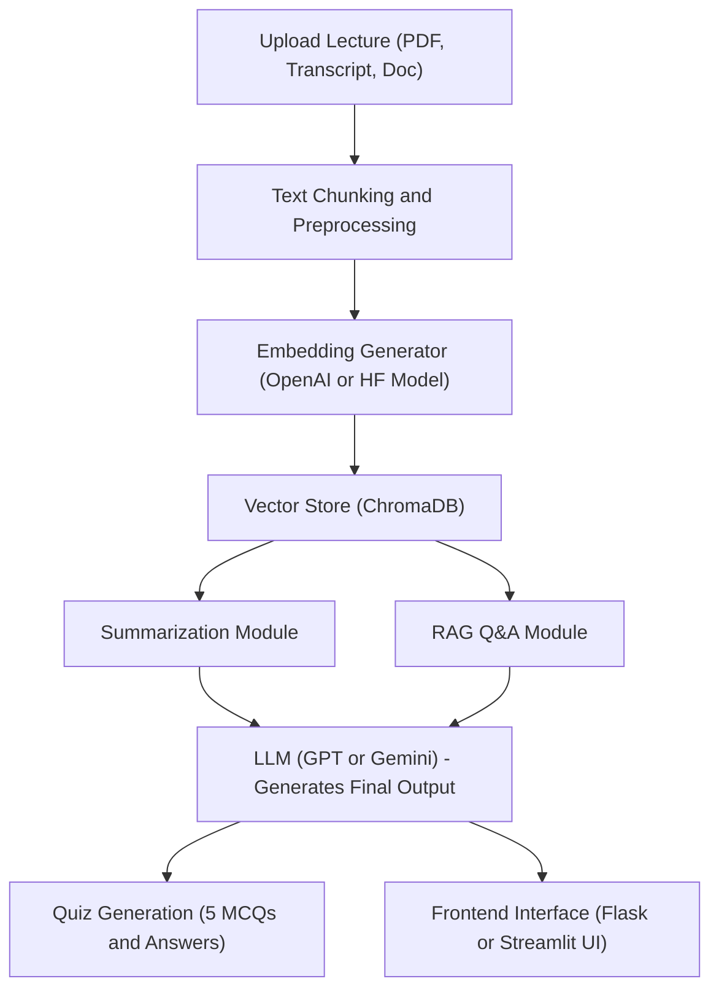

# Problem Statement

In the modern education system, students often face two major challenges:
Difficulty in understanding and retaining key lecture content.
Lack of instant, reliable support to clarify academic doubts and reinforce learning.
Traditional classroom setups and online courses provide abundant information, but not personalized understanding. Students need an interactive AI assistant that helps them grasp, review, and test knowledge efficiently.

# Proposed Solution

EduMentor is an AI-powered educational assistant that combines:
Lecture Summarization & Quiz Generation – Summarizes uploaded lecture transcripts or notes and automatically generates 5-question MCQs for revision.
AI Tutor Chatbot – Acts as a knowledge-aware chatbot that answers academic questions based on textbooks, lecture data, or uploaded materials.
Together, these features create a personalized, retrieval-augmented learning experience powered by RAG (Retrieval-Augmented Generation) and LLMs (Large Language Models).

# Key Features

Generate structured summaries with key insights.
Auto-create MCQ quizzes for quick revision and testing.
Ask subject-specific questions via the AI Tutor and receive precise answers with cited sources.
Built using RAG pipeline for context-grounded responses and LLM for natural text generation.

# Tech Stack

| Layer                   | Tools / Technologies                                |
| ----------------------- | --------------------------------------------------- |
| **Frontend (Optional)** | Streamlit / Flask UI                                |
| **Backend / API**       | Python, FastAPI                                     |
| **Core Intelligence**   | LangChain, OpenAI GPT / Gemini API                  |
| **Vector Storage**      | ChromaDB / FAISS                                    |
| **Embeddings**          | `text-embedding-3-small` or `sentence-transformers` |
| **Data Processing**     | Pandas, NumPy                                       |

# System Architecture

## 1. Data Ingestion
Input lecture transcripts, textbook chapters, or notes.
Data is chunked into small text blocks for efficient retrieval.

## 2. Embedding & Storage
Each text chunk is converted into an embedding vector using OpenAI or HuggingFace models.
Stored in ChromaDB for similarity-based retrieval.

## 3. RAG Pipeline
On receiving a query, similar chunks are retrieved from the vector store.
These are passed to an LLM (e.g., GPT or Gemini) to generate a factual, contextual answer.

## 4. Lecture Summarization
The same data pipeline is used to create summaries of uploaded lectures.
Extracts key concepts, learning objectives, and core ideas.

## 5. Quiz Generation
The LLM processes summarized text and creates 5 multiple-choice questions with correct answer keys.

## 6. Interactive Chat
Users can ask questions related to the uploaded content.
The RAG-powered Tutor provides context-grounded explanations and citations from retrieved text.
| **Visualization / UI**  | HTML, CSS (optional dashboard)                      |
| **Dataset Sources**     | Open Textbook Dataset, TED Talks Dataset            |

## Detailed Flow Diagram

## Detailed Flow Diagram

# Gen AI Components

| Component                                | Description                                                                 |
| ---------------------------------------- | --------------------------------------------------------------------------- |
| **RAG (Retrieval-Augmented Generation)** | For retrieving relevant information from lecture and textbook embeddings.   |
| **LLM (Large Language Model)**           | Generates summaries, answers, and quizzes in natural language.              |
| **Embeddings Model**                     | Converts text into high-dimensional vectors for semantic similarity search. |
| **ChromaDB / FAISS**                     | Stores and retrieves relevant content chunks efficiently.                   |
| **LangChain**                            | Manages the workflow between embedding, retrieval, and generation.          |

# Workflow Summary

Upload lecture transcript → Text chunking → Embedding creation.
Store in ChromaDB for semantic retrieval.
Use RAG to retrieve relevant chunks based on queries.
LLM generates contextual answers or summaries.
Quiz generator uses summarized text to form evaluation questions.
Students can interact with the AI Tutor for deeper understanding.

# Expected Outcomes
## Personalized Learning Support:
Students can review content efficiently.
## Instant Academic Help: 
RAG chatbot answers questions based on real content.
## Assessment Integration: 
Quizzes allow self-evaluation after each session.
## Educational Research Aid: 
Facilitates faster topic exploration and comprehension.

# Future Scope

Integration with LMS (Learning Management Systems).
Addition of speech-to-text for real-time lecture summarization.
Enhanced visualization of quiz results and learning analytics dashboard.
Multi-language support for global accessibility.
