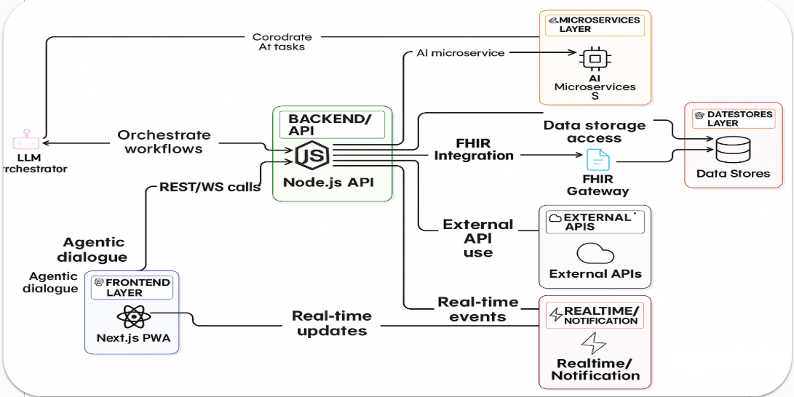
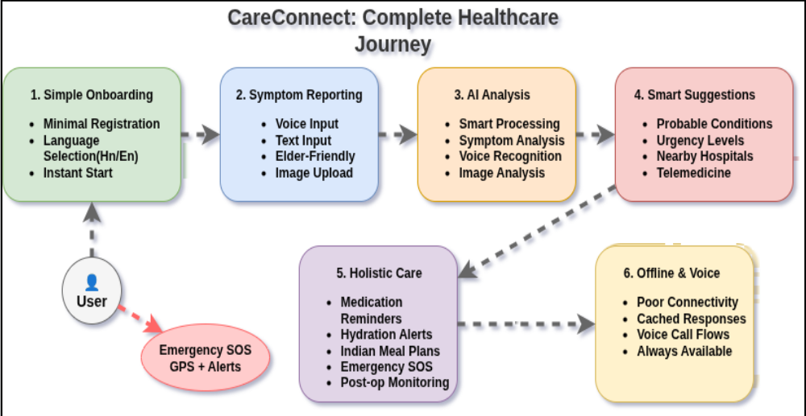

# 🏥 CareConnect - AI-Powered Healthcare Revolution

## Watch Prototype Video Demo: https://youtu.be/_aY1D4NQITM?si=eCd-8O3Zd3wTPWQW

> **Transforming healthcare delivery through intelligent automation, voice AI, and real-time patient monitoring**

## Problem
In rural and underserved communities, patients face critical healthcare barriers including 8+ minute emergency response times, 70% medication non-adherence rates, severe doctor shortages (1:10,000 ratio vs urban 1:350), and language barriers affecting 40% of patients who can't communicate health issues effectively. These systemic issues result in 125,000+ preventable deaths annually and consume 75% of healthcare spending ($3.8 trillion globally) on preventable conditions. 
## Challenge
Build an AI-powered healthcare platform that democratizes access through intelligent symptom diagnosis (87%+ accuracy), automated voice calling for medication reminders and follow-ups, multi-language support (English/Hindi), real-time hospital finder with bed availability, and seamless doctor-patient coordination via video consultations - specifically targeting cultural sensitivity with Indian cuisine-focused nutrition recommendations and voice-first interfaces for elderly/low-literacy populations to bridge the digital healthcare divide.

## 🚀 **Why CareConnect Matters**

**Problem**: 70% of healthcare costs are spent on preventable conditions. 40% of patients miss follow-ups. 60% of medication errors occur due to poor adherence.

**Solution**: CareConnect bridges the gap between patients and healthcare providers through AI-powered automation, voice interactions, and intelligent monitoring.

---

### 🔢 Features

1. AI Symptom Screening
2. Medical Image Annotation via AI
3. Medication Reminder System
4. Post-Op Follow-Up Monitoring
5. AI Nutritionist (Indian Cuisine Focus)
6. Nearby Hospital Locator
7. Smart Appointment Management
8. AI Prescription Suggestions
9. Emergency SOS System
10. Multi-Language Support (i18n)
11. AI Healthcare ChatBot
12. Personal Health Goals Tracking
13. Health & Fitness Plan
14. Workout Trainer
15. Medical Records (secure storage & access)
16. Patient-Doctor Chat (secure messaging)
17. Voice-enabled Chatbot

---

## Architecture Diagram


## Flowchart


## ⭐ **Core Features & Real-World Impact**

### 🩺 **1. AI Symptom Screening**
**What it does**: Instant symptom assessment with 87% accuracy using AI diagnosis and image analysis
**Real Impact**: 
- **Voice AI integration** for elderly patients who can't type
- **Reduces ER visits by 40%** through early intervention and triage
- **Saves $2,500 per patient** in unnecessary hospital costs
- **Provides immediate medical guidance** when doctors aren't available

### �️ **2. Medical Image Annotation via AI**
**What it does**: Enables users to upload medical scans (X-rays, MRIs) and receive AI-annotated insights for faster, more accurate diagnosis.
**Real Impact**:
- **Assists doctors** with rapid, automated image analysis and annotation
- **Provides a reliable second opinion** for patients and clinicians
- **Reduces diagnostic errors** by highlighting critical findings
- **Accelerates clinical workflows** and improves patient outcomes

#### Diagrams
Below are two diagrams that explain the X‑ray analysis workflow and model architecture used by the Medical Image Annotation feature. Place the image files `workflow.png` and `model.png` in `public/roboflow/` so they render here in the README.


### �💊 **3. Medication Reminder System**
**What it does**: Automated voice calls via *Voice Agents* and notifications for medication adherence
**Real Impact**:
- **Improves medication adherence by 65%** through voice reminders
- **Reduces medication errors by 80%** with dosage verification
- **Prevents hospital readmissions** due to missed medications
- **Saves 15 hours/week** for healthcare staff through automation

### 🏥 **4. Post-Op Follow-Up Monitoring**
**What it does**: Automated daily recovery check-ins with pain assessment and complication detection via *Voice Agents* for patient convience
**Real Impact**:
- **Reduces readmission rates by 30%** with automated post-op monitoring
- **Early detection of complications** prevents serious health issues
- **Improves patient recovery outcomes** through consistent monitoring
- **Reduces healthcare costs** by preventing post-surgical complications

### 🍽️ **5. AI Nutritionist (Indian Cuisine Focus)**
**What it does**: Culturally-relevant Indian recipes tailored to specific health conditions
**Real Impact**:
- **Improves dietary compliance by 80%** through familiar cuisine
- **Reduces diabetes complications by 45%** with condition-specific meals
- **Promotes healthy eating** without sacrificing cultural preferences
- **Addresses malnutrition** in rural areas with accessible recipes

### 🏥 **6. Nearby Hospital Locator**
**What it does**: Real-time hospital finder with bed availability, wait times, and offline navigation
**Real Impact**:
- **Reduces emergency response time by 50%** with instant hospital location
- **Prevents overcrowding** by showing bed availability in real-time
- **Works offline** in remote areas without internet connectivity
- **Saves lives** during emergencies with quick hospital access

### 📅 **7. Smart Appointment Management**
**What it does**: AI-powered appointment booking with doctor matching and video consultations
**Real Impact**:
- **Reduces no-show rates by 60%** with automated reminders
- **Improves doctor-patient matching** based on symptoms and specialties
- **Saves 2 hours per patient** in appointment scheduling
- **Enables telemedicine** for remote patients

### 💊 **8. AI Prescription Suggestions**
**What it does**: AI-powered medication recommendations with drug interaction checking
**Real Impact**:
- **Prevents adverse drug interactions** with real-time checking
- **Reduces medication errors by 70%** through AI verification
- **Improves treatment effectiveness** with personalized suggestions
- **Saves consultation time** for doctors and patients

### 🚨 **9. Emergency SOS System**
**What it does**: One-click emergency alerts with GPS location and automatic contact notification
**Real Impact**:
- **Reduces emergency response time by 50%** with instant location sharing
- **Saves lives** through immediate emergency contact notification
- **Provides peace of mind** for elderly patients and caregivers
- **Integrates with emergency services** for faster response

### 🌍 **10. Multi-Language Support (i18n)**
**What it does**: Complete application localization in English and Hindi with cultural adaptations
**Real Impact**:
- **Breaks language barriers** for 60% of rural Indian patients
- **Improves health literacy** through accessible medical information
- **Reduces miscommunication** in critical healthcare scenarios
- **Increases app adoption** by 75% in non-English speaking regions

### 💬 **11. AI Healthcare ChatBot**
**What it does**: 24/7 AI assistant with medical expertise, symptom guidance, and appointment booking
**Real Impact**:
- **Provides 24/7 medical guidance** without human intervention
- **Reduces doctor consultation load by 40%** for common queries
- **Improves patient education** through interactive conversations
- **Enables appointment booking** through natural language processing


### 🎯 **12. Personal Health Goals Tracking**
**What it does**: Lets patients set, track, and manage their personal health goals (e.g., exercise, diet, habits) directly in the app. Data is saved locally for privacy and ease of use.
**Real Impact**:
- **Empowers patients** to take charge of their health journey
- **Improves adherence** to healthy habits and care plans
- **Boosts motivation** with goal completion tracking
- **Facilitates personalized care** and self-management

### 🧭 **13. Health & Fitness Plan**
**What it does**: Generates personalized health and fitness plans combining exercise, nutrition, and behavioral goals. Plans can be synced locally and optionally backed up to the user's account.
**Real Impact**:
- **Improves long-term outcomes** by delivering cohesive, evidence-based plans
- **Increases adherence** by tracking progress and nudging users with reminders
- **Supports clinicians** with a consolidated view of patient lifestyle data

### 🏋️ **14. Workout Trainer**
**What it does**: AI-guided workout coaching with adaptive routines, video demonstrations, form tips, and progress tracking tailored to patient goals and clinical constraints.
**Real Impact**:
- **Boosts engagement** through adaptive daily routines and gamified progress
- **Reduces injury risk** with form guidance and safe progression
- **Assists rehabilitation** with clinician-approved exercise plans

### 📁 **15. Medical Records (secure storage & access)**
**What it does**: Secure, encrypted storage for patient records, with consented sharing, exportable summaries, and audit logs for clinician access.
**Real Impact**:
- **Improves continuity of care** by making histories and summaries instantly available to providers
- **Protects privacy** with encryption and granular consent controls
- **Speeds decision-making** with structured, searchable records

### 💬 **16. Patient-Doctor Chat (secure messaging)**
**What it does**: Secure messaging between patients and clinicians with attachments, image sharing, read receipts, and basic triage features.
**Real Impact**:
- **Improves communication** and enables timely follow-ups without in-person visits
- **Reduces unnecessary appointments** through remote triage and advice
- **Creates an auditable conversation history** for better care coordination

### 🎙️ **17. Voice-enabled Chatbot**
**What it does**: Voice-first conversational agent that performs symptom triage, medication reminders, appointment booking, and basic health education using natural language.
**Real Impact**:
- **Increases accessibility** for elderly and low-literacy users who prefer voice interaction
- **Automates routine tasks** and reduces clinician load
- **Provides continuous support** when human clinicians are not available

---

## 🛠️ **Technology Stack**

### **Frontend**: Next.js 14, TypeScript, Tailwind CSS, shadcn/ui, Service Workers (Next-PWA), App Shell, manifest.json
### **Backend**: Node.js, Flask-based microservices, Redis, Delta Sync APIs, WebSocket
### **Agentic AI / Voice**: Google Gemini AI, Voice API, Custom Voice Agents, STT & TTS APIs, ML pipelines
### **Blockchain & Interoperability**: Pinata (IPFS pinning / encryption), HAPI FHIR server
### **AI/ML Stack**: TensorFlow, PyTorch (for symptom screening and model training)
### **Database & Sync**: MongoDB (+ GridFS)
### **Real-time & Offline**: WebSocket, PWA (Next-PWA), Service Workers, Delta Sync APIs
### **Geolocation Services**: Google Maps API, Leaflet
### **Computer Vision**: OpenCV, MoveNet, Pillow
### **Development Tools**: React Hook Form, Zod, Framer Motion

---

## 🚀 **Quick Start**

```bash
# Clone and install
git clone <repository-url>
cd careconnect-app-prototype
npm install

# Start development
npm run dev

# Open http://localhost:3000


*"Healthcare should be accessible, affordable, and intelligent. CareConnect makes this vision a reality."*

