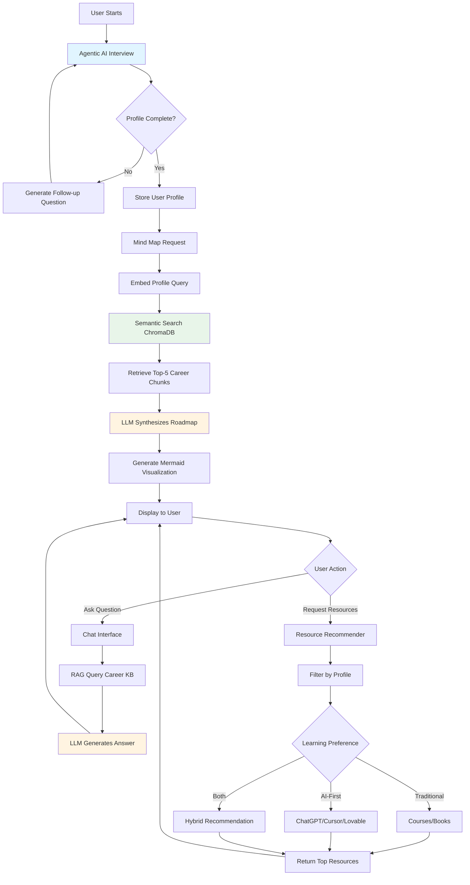

# 🎯 AI-Powered Personalized Career Guidance Platform

> An intelligent career counseling system that creates personalized career roadmaps using RAG, Agentic AI, and LLMs to guide students toward their ideal career paths with modern AI-first learning recommendations.

---

## 📋 Problem Statement

Students and individuals face critical challenges when choosing career paths:

- **Information Overload**: Thousands of career options and conflicting advice create decision paralysis
- **Generic Guidance**: One-size-fits-all advice that ignores individual personas, learning styles, and circumstances
- **Outdated Methodology**: Career advisors recommend only traditional learning (courses, degrees) without awareness of modern AI-first tools (Cursor, Lovable, ChatGPT, etc.)
- **Lack of Personalization**: Current solutions don't consider location, interests, current academic standing, or learning preferences
- **No Actionable Roadmap**: Missing clear, visual, step-by-step paths from current state to goal achievement
- **Modern vs Traditional Gap**: Students unaware that building apps can take 6-12 months with traditional coding OR 1-2 weeks using AI-assisted tools

**Impact**: Wrong career choices, wasted time/resources, missed opportunities in emerging fields, inefficient learning paths using outdated methodologies.

---

## 💡 Proposed Solution

An intelligent platform combining **Agentic AI, RAG, and LLMs** for truly personalized career guidance:

### Core Features

1. **Intelligent Persona Profiling Agent** - Conducts adaptive interviews capturing location, goals, interests, academic standing, learning style, and time availability
2. **RAG-Powered Career Knowledge Engine** - Maintains up-to-date knowledge base of careers, skills, trends, and resources
3. **Dynamic Mind Map Generator** - Creates NotebookLM-style interactive hierarchical visualizations (Career → Sub-Domains → Skills → Resources)
4. **Contextual Chat Interface** - LLM-powered Q&A with conversation memory and profile context
5. **Modern Resource Recommender** - Dual-track recommendations: Traditional (courses, books) AND AI-First (ChatGPT, Cursor, Lovable, Firebase)

---

## 🏗️ Minimum Viable Product (MVP)

### ✅ In-Scope (24-Hour Hackathon)

- **Persona Profiling Module**: 8-12 adaptive questions using Agentic AI → Structured user profile JSON
- **Career Knowledge Base**: 20+ career domains, 100+ sub-specializations, 500+ skills, 200+ resources
- **RAG Pipeline**: Document chunking, embedding, ChromaDB storage, semantic search, LLM synthesis
- **Mind Map Generation**: LLM-powered roadmap structuring → Mermaid.js visualization (3-level hierarchy)
- **Career Chat Assistant**: LangChain ConversationalRetrievalChain with context memory
- **Resource Recommender**: Filters by profile, categorizes Traditional vs AI-First, returns top 5-10 with rationale

**Deliverables**: Jupyter Notebooks, Python scripts, sample knowledge base, README, requirements.txt, demo video

### ❌ Out of Scope

Real-time job APIs, user authentication, production UI, mobile apps, mentor matching, progress tracking, multi-language support

---

## 🛠️ Tech Stack

| Component | Technology | Purpose |
|-----------|-----------|---------|
| **Language** | Python 3.10+ | Core development |
| **Framework** | FastAPI | REST API endpoints |
| **AI Orchestration** | LangChain | RAG pipeline, agents, prompts |
| **LLM** | OpenAI GPT-4 / Claude 3.5 / Gemini 1.5 Pro | NLU, generation, reasoning |
| **Embeddings** | OpenAI text-embedding-3-small / HuggingFace all-MiniLM-L6-v2 | Semantic search |
| **Vector Database** | ChromaDB | Store/retrieve embedded knowledge |
| **Data Processing** | Pandas | Career data manipulation |
| **Visualization** | Mermaid.js | Mind map generation |
| **Validation** | Pydantic | Structured data models |
| **Environment** | Jupyter Notebook | Prototyping and demo |

---

## 🤖 Generative AI Technologies Used

### 1. **Embeddings & Semantic Search**
- **Models**: OpenAI text-embedding-3-small (1536D) or HuggingFace all-MiniLM-L6-v2 (384D)
- **Use Cases**: Convert career documents to vectors, match user profiles to career paths semantically

### 2. **RAG (Retrieval Augmented Generation)**
- **Architecture**: LangChain + ChromaDB + LLM
- **Workflow**: 
  - **Indexing**: Career docs → Chunked (500 tokens) → Embedded → ChromaDB
  - **Retrieval**: User query → Embedded → Semantic search → Top-5 chunks
  - **Generation**: Retrieved chunks + Query → LLM → Synthesized answer with citations
- **Benefits**: Factual grounding, reduced hallucinations, source attribution, scalable updates

### 3. **Prompt Engineering**
- **Techniques**: System prompts (career advisor persona), few-shot examples (mind map structures), chain-of-thought reasoning, context window optimization

### 4. **Structured Output Generation**
- **Technology**: Pydantic models + LangChain parsers
- **Use Cases**: Validated persona profile JSON, hierarchical career roadmap, resource metadata

---

## 📊 System Flow Diagram

## 🎥 Demo Video

📹 **[Watch Full Demo on YouTube](https://youtube.com/placeholder)**

**Demo Highlights**:
- Persona profiling session
- Mind map visualization
- Chat interface interaction
- Resource recommendations (Traditional vs. AI-First)

---

## 👥 Team & Contributors

**Team Members**:
- [M. Tejaswanth] - AI/ML Development, RAG Pipeline
- [M. Jatin Rishi] - Data Curation
- [N. Maniteja] - Visualization, Documentation

**Hackathon**: GenAIVersity Hackathon (October 2025)

**Acknowledgments**:
- GenAIVersity organizing team
- ChromaDB communities
- OpenAI/Anthropic/Google for LLM APIs
---

## 📞 Contact & Links

- **GitHub Repository**: https://github.com/Maniteja8883/OG-Decoders-Group-AD.git
- **Demo Video**: [https://youtu.be/iTSIsEYzkB8]
  
---

## 🌟 Key Differentiators

✨ **What makes this project unique:**

1. ✅ **Modern vs. Traditional Awareness**: First career guidance system that recommends both traditional learning AND AI-first tools
2. ✅ **True Personalization**: Agentic AI conducts adaptive interviews, not static forms
3. ✅ **Visual Roadmaps**: NotebookLM-style mind maps, not linear text lists
4. ✅ **RAG-Grounded**: Recommendations backed by curated knowledge base with citations
5. ✅ **Contextual Chat**: LLM remembers your profile and provides personalized answers
6. ✅ **Technology Stack Excellence**: Production-grade tools (LangChain, ChromaDB, GPT-4)

---

## 🚀 Future Scope

1. **Real-Time Job Market Integration** - LinkedIn/Indeed APIs for live job postings, salary trends, demand metrics
2. **Adaptive Learning Paths** - Track user progress, adjust roadmap based on milestones, personalized skill gap analysis
3. **Multi-Modal Input** - Voice profiling (Whisper API), resume upload for skill extraction
4. **Mentor Matching System** - Connect users with industry professionals based on AI-powered matching
5. **Peer Learning Community** - Discussion forums, study groups, resource sharing by career domain
6. **Skill Certification & Verification** - Integration with Coursera/edX APIs, digital credential wallet
7. **Gamification** - Achievement badges, leaderboards, daily challenges, progress dashboard
8. **Multi-Language Support** - Hindi, Spanish, French, etc. with cultural context adaptation
9. **Educational Institution Integration** - White-label solution for schools/colleges with batch onboarding
10. **Mobile Applications** - iOS/Android apps with offline mode and push notifications
11. **Advanced AI** - Fine-tuned career counseling LLM, predictive analytics, personality assessment integration
12. **API & Developer Ecosystem** - Public API, Zapier connectors, Chrome extension, embeddable widgets

---
