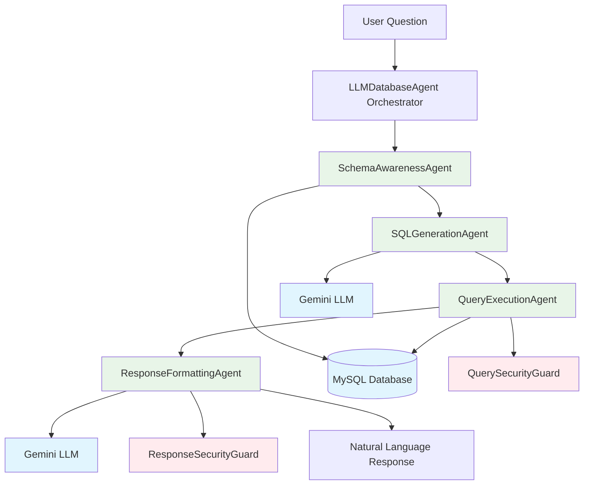

# 🤖 Web Activity Agent System - Documentation

## 🎯 Project Overview

The **Web Activity Agent System** is an intelligent multi-agent system that converts natural language questions into SQL queries. Users can ask questions about their web activity and GitHub data in plain English, and the system provides insightful responses with visualizations.

### Key Capabilities

- **Natural Language → SQL**: Ask questions in plain English
- **Multi-Agent Architecture**: Specialized agents for different tasks
- **Schema Awareness**: Dynamic database understanding
- **Secure**: Read-only database with multiple security layers
- **Visual**: Automatic chart generation for data insights
- **Intelligent**: Powered by Google Gemini 2.5 Pro

---

## 🏗️ System Architecture

```
┌─────────────────────────────────────────────────────────┐
│                  User Question (Natural Language)        │
└─────────────────────────────────────────────────────────┘
                         ↓
┌─────────────────────────────────────────────────────────┐
│                   Main Orchestrator                     │
│              LLMDatabaseAgent                           │
│  - Coordinates specialized agents                        │
│  - Manages execution flow                               │
│  - Returns structured JSON response                     │
└─────────────────────────────────────────────────────────┘
                         ↓
┌─────────────────────────────────────────────────────────┐
│              Sequential Agent Execution                  │
│                                                          │
│  1. SchemaAwarenessAgent → 2. SQLGenerationAgent        │
│      ↓                         ↓                         │
│  3. QueryExecutionAgent → 4. ResponseFormattingAgent   │
│                                                          │
└─────────────────────────────────────────────────────────┘
                         ↓
┌─────────────────────────────────────────────────────────┐
│            Natural Language Response + Results           │
└─────────────────────────────────────────────────────────┘
```

---

## 🤖 Agent System

### Agent Architecture

The system uses **4 specialized agents** that work sequentially:

#### 1. **SchemaAwarenessAgent** 📋

**What it does**: Discovers database structure and provides context

**How it works**:
```python
# Discovers all tables, columns, and data types
schema = {
    "web_activity": {
        "columns": ["id", "user_id", "website_name", "time_spent", "activity_date"],
        "sample_data": [...]  # Actual data samples
    },
    "github_activity": {...}
}

# Provides exact database values to LLM
schema_info = "website_name: 'youtube.com', 'github.com', 'stackoverflow.com'..."
```

**Tools**: MySQL Database

**Output**: Complete database schema with sample data

---

#### 2. **SQLGenerationAgent** 🔍

**What it does**: Converts natural language to SQL queries

**How it works**:
```python
# Receives schema info and user question
prompt = """
Schema: {database structure with samples}
Question: "How much time did I spend on YouTube today?"

Rules:
1. Use SELECT only (READ-ONLY)
2. Include WHERE user_id = %s
3. Use exact database names from schema
4. Return JSON with sql_query

Generate SQL query...
"""

# Generates parameterized SQL
sql = "SELECT website_name, SUM(time_spent) as total 
       FROM web_activity 
       WHERE user_id = %s AND website_name = 'youtube.com' 
       GROUP BY website_name"
```

**Tools**: Google Gemini 2.5 Pro LLM

**Output**: Parameterized SQL query (JSON format)

---

#### 3. **QueryExecutionAgent** ⚡

**What it does**: Executes SQL queries safely and returns results

**How it works**:
```python
# Step 1: Security validation
is_safe = security_guard.validate_query(sql, user_id)
# Checks: dangerous keywords, user_id filtering, modification patterns

# Step 2: Execute query
results = db_manager.execute(sql, params=[user_id])

# Step 3: Return structured results
return {
    "success": True,
    "results": [...],      # Actual data
    "row_count": 5,
    "columns": ["website_name", "total"]
}
```

**Tools**: MySQL Database + QuerySecurityGuard

**Output**: Query results with metadata

**Security Checks**:
- ✅ Blocks dangerous keywords (DROP, DELETE, UPDATE, etc.)
- ✅ Ensures user_id filtering
- ✅ Prevents data modification (arithmetic operations)
- ✅ Blocks system table access
- ✅ Validates UNION query safety

---

#### 4. **ResponseFormattingAgent** 💬

**What it does**: Converts raw query results into natural language

**How it works**:
```python
# Receives raw results
results = [{"website": "youtube.com", "total": 120}]

# Generates natural language response
prompt = """
Question: "How much time did I spend on YouTube today?"
Results: {results}

Provide a conversational response explaining the data.
"""

response = llm.generate(prompt)
# Output: "You spent 120 minutes on YouTube today."
```

**Tools**: Google Gemini 2.5 Pro LLM + ResponseSecurityGuard

**Output**: 
```json
{
  "response": "You spent 120 minutes on YouTube today.",
  "results": [...],
  "sql_query": "...",
  "timestamp": "...",
  "agents_used": [...]
}
```

---

## 🔄 Complete Workflow

### Step-by-Step Execution

```python
def process_question(question, user_id):
    # 1. Get Database Schema
    schema_info = schema_agent.get_database_schema()
    # Returns: Tables, columns, sample data
    
    # 2. Generate SQL Query
    sql_result = sql_agent.generate_sql_query(
        question=question,
        user_id=user_id,
        schema_info=schema_info
    )
    # Returns: {"sql_query": "...", "reasoning": "...", "confidence": 0.95}
    
    # 3. Execute Query
    query_result = query_agent.execute_query(
        sql_query=sql_result["sql_query"],
        user_id=user_id
    )
    # Returns: {"success": True, "results": [...], "row_count": 5}
    
    # 4. Format Response
    final_response = response_agent.format_response(
        question=question,
        query_results=query_result,
        sql_query=sql_result["sql_query"]
    )
    # Returns: {"response": "...", "results": [...], "success": True}
    
    return final_response
```

---

## 🛡️ Security Guards

### QuerySecurityGuard

**Purpose**: Validates SQL queries before execution

**Security Rules**:
```python
# ❌ BLOCKED Operations
- DROP, DELETE, UPDATE, INSERT, ALTER
- Multiple statements (; DROP TABLE...)
- System table access
- Data modification (arithmetic: +, -, *, /)
- Missing user_id filtering

# ✅ ALLOWED Operations
- SELECT queries only
- Parameterized queries (WHERE user_id = %s)
- UNION queries (with validation)
- Aggregation functions (SUM, COUNT...)

# Example Validation Result
{
    "is_safe": True,
    "reason": "Query is safe"
}

# OR
{
    "is_safe": False,
    "reason": "Dangerous keyword detected: DROP"
}
```

### ResponseSecurityGuard

**Purpose**: Sanitizes LLM responses

**Security Rules**:
```python
# Removes:
- Script injections (<script>...</script>)
- Malicious JavaScript
- SQL injection attempts
- Excessive response length
```

---

## 📊 Example Workflow

### Input: "How much time did I spend on YouTube today?"

```
Step 1: SchemaAwarenessAgent
┌─────────────────────────────────────┐
│ Returns:                            │
│ - web_activity table structure      │
│ - Sample data showing youtube.com   │
│ - Column names and types             │
└─────────────────────────────────────┘

Step 2: SQLGenerationAgent
┌─────────────────────────────────────┐
│ Returns:                            │
│ SQL: SELECT website_name,           │
│       SUM(time_spent) as total      │
│ FROM web_activity                   │
│ WHERE user_id = %s                  │
│ AND website_name = 'youtube.com'    │
└─────────────────────────────────────┘

Step 3: QueryExecutionAgent
┌─────────────────────────────────────┐
│ Validates: ✅ Safe query            │
│ Executes: Query on database         │
│ Returns:                            │
│ [{website_name: "youtube.com",     │
│   total: 120}]                       │
└─────────────────────────────────────┘

Step 4: ResponseFormattingAgent
┌─────────────────────────────────────┐
│ Returns:                            │
│ "You spent 120 minutes on          │
│  YouTube today."                    │
└─────────────────────────────────────┘
```

---

## 🔐 Security Features

### 1. Read-Only Database

Only SELECT queries are allowed. The system **never modifies data**.

**Detection**: If LLM generates a query with arithmetic operations like `SUM(commit_count) + 1`, the system:
- ✅ Detects the modification attempt
- ✅ Blocks the query
- ✅ Returns graceful response: "I can only view your data, not modify it"

### 2. User ID Filtering

Every query **must** include `WHERE user_id = %s` to prevent cross-user data access.

### 3. Multi-Layer Validation

```python
# Layer 1: Security Guards
query_guard.validate_query(sql, user_id)

# Layer 2: Query Execution Agent
query_agent.check_for_modification(sql)

# Layer 3: Database Manager
db_manager.execute_with_validation(sql, params)
```

---

## 🎨 Visual Architecture



---

## 💡 How It Works

### Key Principles

1. **Schema Awareness**: LLM knows exact database structure and values
2. **Sequential Processing**: Agents work in strict order
3. **Security First**: Multiple validation layers
4. **Read-Only**: Never modifies data
5. **User Isolation**: All queries filtered by user_id

### Natural Language Processing

```
User: "Add 1 to my commit count"
      ↓
System: Detects modification attempt
      ↓
Response: "I can only view your data, not modify it. 
          Here's your current commit count: 5"
```

### Multi-Table Queries (UNION)

```
User: "Show all my activity for today"
      ↓
System: Uses UNION to combine web_activity + github_activity
      ↓
SQL: SELECT 'Web' as type, website_name as name, ... 
     UNION ALL 
     SELECT 'GitHub' as type, repo_name, ...
```

---

## 📁 Project Structure

```
agents/
├── core/
│   ├── llm_agent.py               # Main orchestrator
│   ├── schema_agent.py            # Schema discovery
│   ├── sql_agent.py               # SQL generation
│   ├── query_execution_agent.py   # Query execution
│   └── response_formatting_agent.py # Response formatting
├── guards/
│   └── security_guards.py         # Security validation
└── schemas.py                     # Pydantic schemas

backend/
├── api/
│   └── agent_endpoints.py         # API endpoints
└── database/
    └── db_manager.py              # Database operations

streamlit_app.py                    # Frontend UI
main.py                             # Flask backend
```

---

## 🚀 Key Technologies

- **Google Gemini 2.5 Pro**: LLM for SQL generation and response formatting
- **MySQL**: Database storage
- **LangChain**: LLM integration framework
- **Pydantic**: Schema validation
- **Streamlit**: Frontend interface
- **Flask/FastAPI**: Backend API

---

## 🎯 What Makes This Different

1. **True Schema Awareness**: LLM sees actual database structure and data
2. **No Training Required**: Works immediately with any database
3. **Multi-Agent**: Specialized agents for each task
4. **Secure by Design**: Read-only with multiple security layers
5. **Intelligent Responses**: Not just SQL, but human-readable insights

---

**Last Updated**: January 2025  
**Version**: 1.0.0
