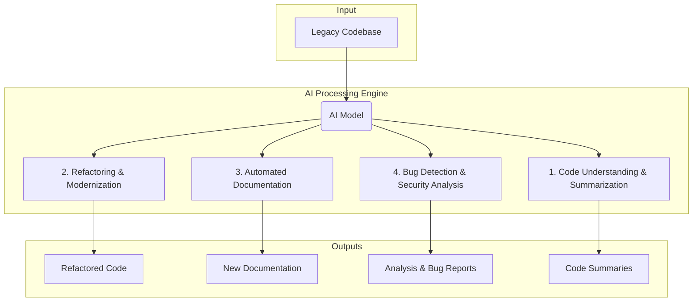

## CodeArchi 
An AI-powered agent that transforms massive, complex legacy codebases into interactive, understandable knowledge bases bringing it back to life.

## The Problem
Every major tech company and financial institution runs on millions of lines of aging, often undocumented, legacy code.

Onboarding new engineers onto these systems is notoriously slow, expensive, and painful. Understanding where to make a change, how a feature works, or what a 1,000-line file does can take weeks of painful digging and relying on a handful of senior engineers who still remember the original logic.

## Our Solution
CodeArchi is an AI agent that "reads" an entire legacy codebase and generates a complete, interactive knowledge base.

It allows any developer—from a new hire to a senior architect—to query the entire repository in plain English and get instant, context-aware answers. It's designed to be the ultimate co-pilot for any team tasked with maintaining or modernizing old systems.

This prototype is a web application built on a modern AI stack:

**Ingestion**: A simple web interface allows a user to provide a link to a GitHub repository.

**Indexing**: The system clones the repo and uses a Large Language Model (LLM) with Retrieval-Augmented Generation (RAG). It intelligently parses, chunks, and creates vector embeddings for the entire codebase (including functions, classes, comments, and documentation).

**Querying**: The user interacts with the indexed data through a natural language chat interface. The LLM uses the retrieved context from the vector database to provide accurate, detailed answers.

## SOME EXAMPLES THAT CAN BETTER DEFINE OUR PROJECT
1.Natural Language Q&A: Ask plain-English questions about the code's structure, logic, and purpose.

Example: "Where is the user authentication logic initialized?"

2.On-Demand Visualization: Automatically generate diagrams to explain complex code flows and relationships.

Example: "Generate a sequence diagram for the processPayment function."

3.Intelligent Code Summarization: Get high-level, easy-to-understand explanations for dense files or functions, tailored to your audience.

Example: "What does this 1,000-line C++ file do? Explain it to me like I'm a new hire."

## CORE IMPORTANCE OF THIS APPLICATION
1.A tool that instantly makes old code understandable is a massive force multiplier for any tech organization.

2.Drastically Reduce Onboarding Time: Slashes the time it takes for new engineers to become productive from months to days.

3.Accelerate Development & Debugging: Helps existing engineers find bugs, understand dependencies, and add new features faster.

4.De-risk Modernization: Makes it safer, cheaper, and faster to refactor, migrate, or update legacy systems.

5.Capture Institutional Knowledge: Preserves critical system knowledge currently trapped in the heads of a few senior developers.

6.This project demonstrates a scalable solution to a real-world, high-value enterprise problem using modern AI.

7.Interactive Knowledge Base: The entire repository becomes a searchable, queryable database, making code discovery fast and efficient.

